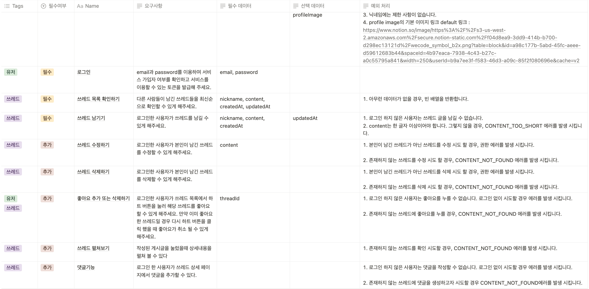

# threadsCloneBackend

# 프로젝트 목적

- React와 Express를 활용하여 SNS 가운데 하나인 **Threads**와 동일한 서비스를 구축하는 미니 프로젝트를 진행합니다.
- **Threads**의 가장 핵심적인 기능만을 추려낸 MVP를 선정하고, 기능 단위로 개발 범위를 나누고, 미리 정의된 기능 정의서를 토대로 개발을 진행하는 프로세스를 경험합니다.

# 프로젝트 목표

- **Threads**의 회원가입 기능, 로그인 기능, 게시글 기능을 파악하고 개발합니다.
- **백엔드**는 위 기능들을 구현하기 위해 **회원가입 API, 로그인 API, 게시글 CRUD API**를 개발합니다.

# 기능정의서
